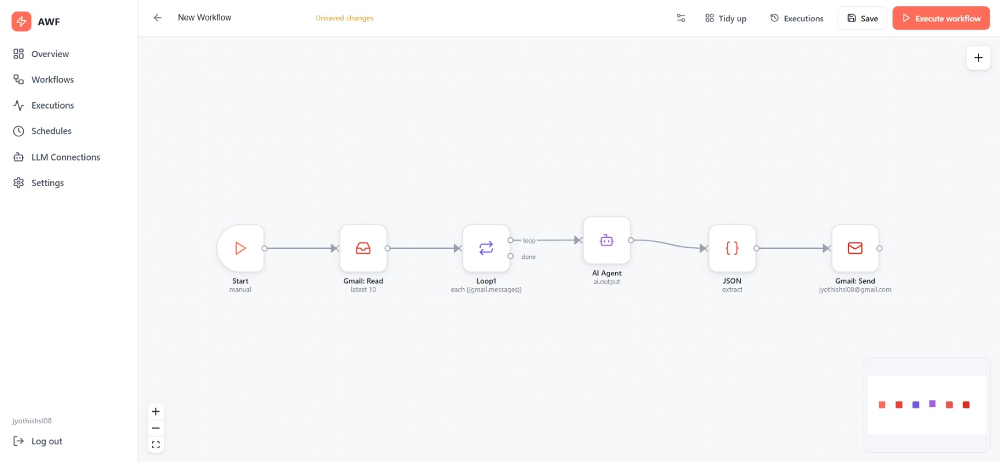
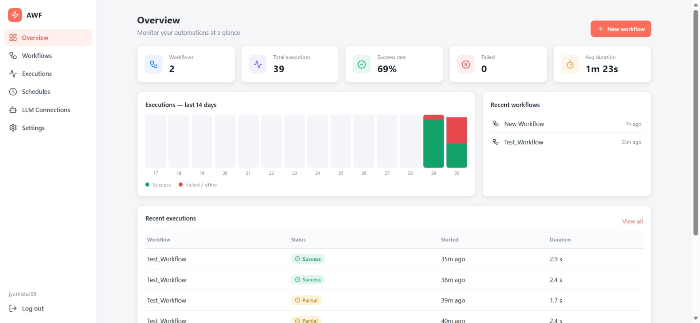
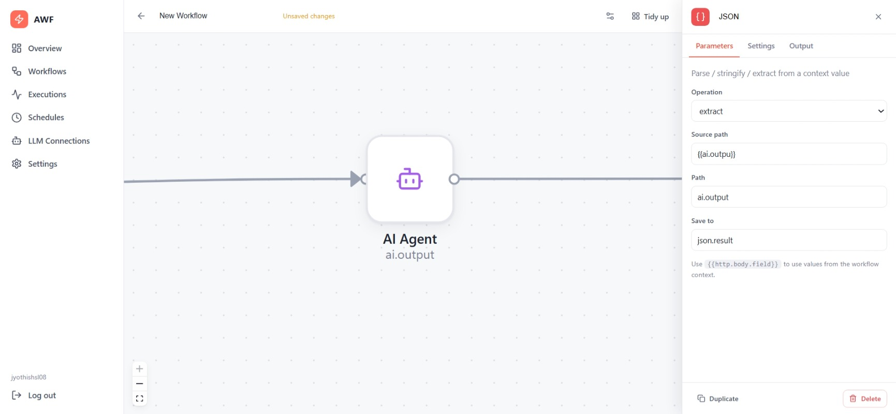
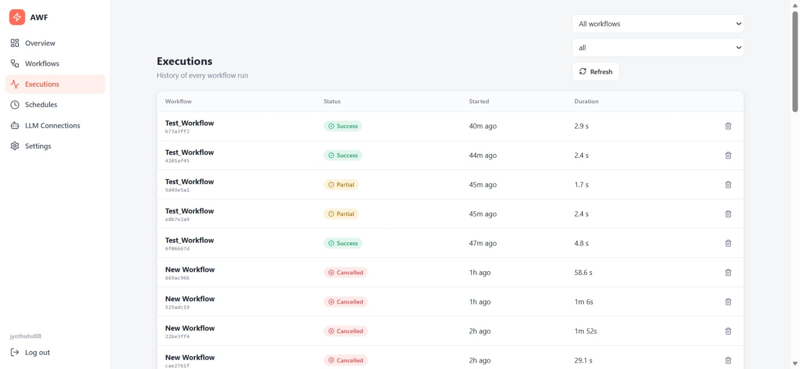
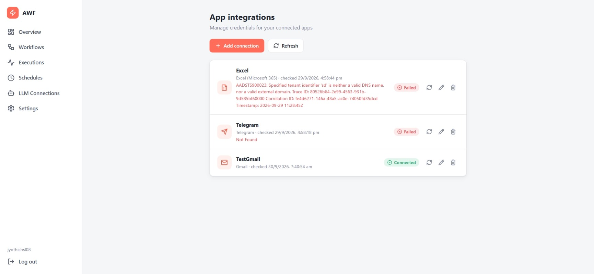
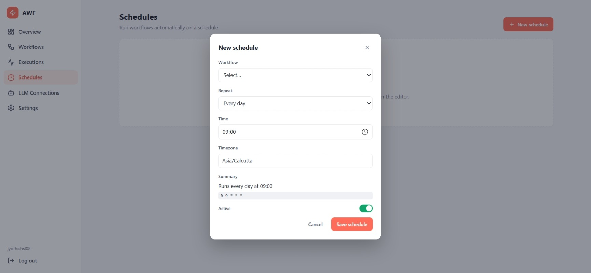

# AI Workflow Framework

> A self-hosted AI workflow automation platform for building, executing, scheduling, and monitoring visual workflows with LLM-powered automation and external application integrations.

AI Workflow Framework (AWF) combines a React-based visual workflow editor with a FastAPI execution engine, PostgreSQL persistence, configurable LLM providers, local Ollama inference, workflow scheduling, execution history, and application integrations.

---

## ✨ Highlights

- **Visual workflow builder** powered by React Flow
- **Node-based workflow execution engine** with branching, loops, waits, conditions, and context variables
- **AI Agent node** with configurable LLM connections
- **OpenAI, Anthropic, Groq, and Ollama** LLM providers
- **Local LLM inference with Ollama**, including automatic model pull when a configured model is missing
- **Gmail read/send nodes** with filtering, unread/attachment options, and attachment handling
- **HTTP Request** node for REST API automation
- **Slack, Discord, and Telegram** workflow nodes
- **Reusable application connections** with encrypted secrets
- **Connection testing** for supported integrations
- **Workflow scheduling** with cron-based schedules
- **Execution history and detailed execution views**
- **Execution cancellation and node-level execution logging**
- **JWT authentication**
- **PostgreSQL persistence**
- **Dockerized frontend/backend architecture**

---

## 🖼️ Screenshots

### Workflow Builder



### Dashboard



### AI Agent



### Workflow Execution



### App Integrations



### Scheduler



---

## 🧩 Workflow Nodes

The current workflow editor includes the following node categories.

### Triggers

| Node | Description |
|---|---|
| Start | Manual or scheduled workflow entry point |

The Start node supports cron-based scheduling and can be synchronized with the scheduler.

### Flow Control

| Node | Description |
|---|---|
| IF | Branch using conditions |
| Switch | Route execution using multiple exact-match cases |
| Loop | Repeat N times or iterate over a list |
| Wait | Pause execution for seconds, minutes, or hours |
| Break | Exit the current loop |
| Continue | Move to the next loop iteration |
| No-op / Merge | Pass-through or branch merge point |

### Data Transformation

| Node | Description |
|---|---|
| HTTP Request | Call REST APIs |
| Transform | Evaluate a Python expression against workflow context |
| Message | Store a message in workflow context |
| Set Fields | Write values to nested context paths |
| JSON | Parse, stringify, or extract JSON values |
| Text Template | Build text using context variables |
| Regex | Match, match-all, or replace text |
| Date & Time | Generate and manipulate date/time values |

### AI

| Node | Description |
|---|---|
| AI Agent | Execute an LLM prompt using a configured LLM connection |

The AI Agent supports:

- System prompts
- User messages
- Context interpolation
- Temperature
- Maximum token limits
- Text or JSON response format
- Optional JSON schema
- Error handling with throw/continue/fallback behavior
- Configurable output context variable

### Apps & Integrations

| Node | Description |
|---|---|
| Send Email | Email workflow step |
| Gmail: Read | Read/filter Gmail messages |
| Gmail: Send | Send Gmail messages |
| Slack | Post through Slack |
| Discord | Post through Discord webhook |
| Telegram | Send Telegram messages |

---

## 🔗 Application Integrations

AWF provides a reusable connection layer for application credentials instead of requiring credentials to be embedded directly in every workflow node.

The current integration catalog includes:

### Email

- SMTP / IMAP
- Gmail
- Outlook / Microsoft mail

### Messaging

- Telegram
- WhatsApp Cloud API
- Slack
- Microsoft Teams
- Discord

### Google Workspace

- Google Sheets
- Google Calendar
- Google Drive
- Google Docs
- Other Google APIs

### Microsoft 365

- Outlook Calendar
- Excel
- OneDrive / SharePoint / Word

### Other

- GitHub
- Notion
- Custom API

> The integration catalog and workflow-node support are separate concepts. A connection can be configured for an application even when a dedicated workflow node for that application is not yet implemented.

---

## 🤖 LLM Support

AI Agent workflows use saved LLM connections.

Supported providers in the backend:

| Provider | Integration |
|---|---|
| OpenAI | OpenAI Chat Completions |
| Anthropic | Anthropic Messages API |
| Groq | OpenAI-compatible API |
| Ollama | Local model inference |

### Ollama

Ollama can be used for local inference without sending prompts to a hosted LLM provider.

The LLM service:

1. Connects to the configured Ollama endpoint.
2. Checks whether the requested model exists.
3. Pulls the model automatically when it is missing.
4. Executes the chat request.
5. Returns the generated response to the workflow.

For Docker-based local development, the default Ollama endpoint is:

```text
http://host.docker.internal:11434
```

---

## 🔄 Example Workflow

A typical AI automation workflow can look like:

```text
┌────────────┐
│   Start    │
└─────┬──────┘
      │
      ▼
┌────────────┐
│ Gmail Read │
└─────┬──────┘
      │
      ▼
┌────────────┐
│  AI Agent  │
│  Analyze   │
└─────┬──────┘
      │
      ▼
┌────────────┐
│     IF     │
└───┬────┬───┘
    │    │
 true│    │false
    ▼    ▼
┌───────┐ ┌──────────┐
│ Slack │ │  Gmail   │
│       │ │  Send    │
└───────┘ └──────────┘
```

Workflow values can be referenced through context paths such as:

```text
{{gmail.messages}}
{{ai.output}}
{{http.body}}
{{user.name}}
```

---

## 🏗️ Architecture

```text
                    ┌──────────────────────────┐
                    │       React Frontend     │
                    │                          │
                    │  React + Vite            │
                    │  React Flow              │
                    │  React Router            │
                    └────────────┬─────────────┘
                                 │
                                 │ REST API
                                 ▼
                    ┌──────────────────────────┐
                    │       FastAPI Backend    │
                    │                          │
                    │ Authentication           │
                    │ Workflow APIs             │
                    │ Integration APIs           │
                    │ LLM APIs                  │
                    │ Scheduling                 │
                    └────────────┬─────────────┘
                                 │
                ┌────────────────┼─────────────────┐
                │                │                 │
                ▼                ▼                 ▼
       ┌────────────────┐ ┌───────────────┐ ┌───────────────┐
       │ PostgreSQL     │ │ Execution     │ │ LLM Service   │
       │                │ │ Engine        │ │               │
       │ Users          │ │               │ │ OpenAI        │
       │ Workflows      │ │ Graph         │ │ Anthropic     │
       │ Executions     │ │ Control Flow  │ │ Groq          │
       │ Integrations   │ │ Node Handlers │ │ Ollama        │
       └────────────────┘ └───────────────┘ └───────┬───────┘
                                                     │
                                                     ▼
                                             ┌───────────────┐
                                             │ External APIs │
                                             │ / Local LLM   │
                                             └───────────────┘
```

---

## 🛠️ Technology Stack

### Frontend

- React 18
- Vite
- React Router
- React Flow (`@xyflow/react`)
- Dagre
- Axios
- Lucide React

### Backend

- Python 3.11
- FastAPI
- Uvicorn
- SQLAlchemy Async
- asyncpg
- Pydantic
- HTTPX
- python-jose / JWT
- Passlib / bcrypt
- Cryptography
- Croniter

### AI / LLM

- OpenAI API
- Anthropic API
- Groq API
- Ollama
- Local LLM inference

### Database

- PostgreSQL
- SQLAlchemy ORM
- PostgreSQL JSONB

### Infrastructure

- Docker
- Docker Compose
- Nginx
- Node.js 20 for frontend builds

---

## 📁 Project Structure

```text
ai-workflow-saas/
│
├── backend/
│   ├── app/
│   │   ├── api/
│   │   │   ├── auth.py
│   │   │   ├── workflow.py
│   │   │   ├── llm_connections.py
│   │   │   ├── app_integrations.py
│   │   │   ├── schedule.py
│   │   │   └── ollama.py
│   │   │
│   │   ├── core/
│   │   │   ├── config.py
│   │   │   ├── crypto.py
│   │   │   └── security.py
│   │   │
│   │   ├── database/
│   │   │   ├── db.py
│   │   │   └── deps.py
│   │   │
│   │   ├── models/
│   │   │   ├── user.py
│   │   │   ├── workflow.py
│   │   │   ├── workflow_execution.py
│   │   │   ├── app_integration.py
│   │   │   ├── llm_connection.py
│   │   │   └── scheduled_workflow.py
│   │   │
│   │   ├── schemas/
│   │   └── services/
│   │       ├── execution/
│   │       ├── execution_engine.py
│   │       ├── gmail_nodes.py
│   │       ├── integration_tester.py
│   │       ├── llm_service.py
│   │       ├── ollama_service.py
│   │       ├── scheduler_worker.py
│   │       ├── schedule_service.py
│   │       ├── workflow_service.py
│   │       └── node_handlers.py
│   │
│   ├── Dockerfile
│   └── requirements.txt
│
├── frontend/
│   ├── src/
│   │   ├── components/
│   │   ├── pages/
│   │   │   ├── auth/
│   │   │   ├── settings/
│   │   │   └── workflow/
│   │   ├── styles/
│   │   └── utils/
│   ├── Dockerfile
│   ├── nginx.conf
│   ├── package.json
│   └── vite.config.js
│
├── screenshots/
│
└── README.md
```

---

## 🔐 Authentication & Security

The backend uses JWT-based authentication for protected application resources.

Sensitive application integration credentials are separated from public configuration and encrypted before being stored.

Examples of sensitive values include:

- API keys
- Passwords
- OAuth client secrets
- OAuth refresh tokens
- Bot tokens
- Webhook URLs
- Other application credentials

The frontend also avoids returning stored secrets when editing an existing integration. Blank secret fields can be left unchanged so previously stored credentials are preserved.

### Important

Never commit real secrets to Git.

Do **not** commit:

```text
backend/.env
frontend/.env
```

if they contain real credentials or secrets.

Use example configuration files instead:

```text
backend/.env.example
frontend/.env.example
```

---

## ⚙️ Configuration

### Frontend

The frontend uses:

```env
VITE_API_URL=http://localhost:8000
```

Other frontend configuration can define application metadata and feature flags.

### Backend

The backend requires database and security configuration such as:

```env
DB_USER=postgres
DB_PASSWORD=<your-password>
DB_NAME=postgres

JWT_SECRET_KEY=<your-secret>
FERNET_KEY=<your-fernet-key>
```

Use strong randomly generated secrets outside local development.

---

## 🐳 Docker

The project is designed to run as a containerized application.

The expected development architecture contains:

```text
Frontend
   │
   ├── React/Vite build
   └── Nginx
          │
          ▼
Backend
   │
   ├── FastAPI
   └── Uvicorn
          │
          ├── PostgreSQL
          │
          └── Ollama
```

Typical local services are:

| Service | Port | Purpose |
|---|---:|---|
| Frontend | `3000` | React application |
| Backend | `8000` | FastAPI API |
| PostgreSQL | `5432` | Application database |
| Ollama | `11434` | Local LLM API |

If the repository contains a `docker-compose.yml`, start the complete stack with:

```bash
docker compose up -d --build
```

Check service status:

```bash
docker compose ps
```

Stop the stack:

```bash
docker compose down
```

---

## ▶️ Local Development

### Backend

```bash
cd backend

pip install -r requirements.txt

uvicorn app.main:app --reload --port 8000
```

API health check:

```text
http://localhost:8000/health
```

### Frontend

```bash
cd frontend

npm install
npm run dev
```

The Vite development server normally runs on:

```text
http://localhost:5173
```

For the Docker/Nginx deployment, the frontend is served on the configured host port, commonly:

```text
http://localhost:3000
```

---

## 🗃️ Database

PostgreSQL stores application state including:

- Users
- Sessions
- Workflows
- Workflow executions
- LLM connections
- Application integrations
- Scheduled workflows

The backend uses SQLAlchemy's asynchronous database support with `asyncpg`.

Database tables are initialized during FastAPI startup.

---

## 📊 Workflow Execution

Each workflow execution maintains execution context and records execution information.

The execution system supports:

- Graph traversal
- Conditional branches
- Loops
- Wait states
- Break / continue control
- Context interpolation
- Node-level logging
- Execution cancellation
- Execution statistics
- Execution detail views

Workflow execution data can be inspected from the application through the execution history and execution detail pages.

---

## ⏰ Scheduling

The application includes scheduling support based on cron expressions.

Examples:

```text
Every minute
* * * * *

Every 15 minutes
*/15 * * * *

Every hour
0 * * * *

Every day at 09:00
0 9 * * *

Every Monday at 09:00
0 9 * * 1
```

The Start node can be configured with:

- Manual trigger
- Scheduled trigger
- Cron expression
- Schedule enabled/disabled state

---

## 📧 Gmail Automation

Gmail automation supports both reading and sending email.

### Gmail Read

The Gmail Read node supports filters including:

- From address
- To address
- Subject
- Body
- Received time range
- Unread-only
- Attachment presence
- Additional Gmail search query
- Folder
- Maximum message count
- Mark as read
- Attachment download

The result is stored in a configurable context variable, by default:

```text
gmail.messages
```

This can then be processed with a Loop node.

### Gmail Send

The Gmail Send node supports:

- To
- CC
- BCC
- Subject
- Plain-text or HTML body
- File attachments
- Attachments from a workflow context list

---

## 🌐 HTTP Automation

The HTTP Request node supports:

- GET
- POST
- PUT
- PATCH
- DELETE

It supports configurable:

- URL
- Headers
- JSON request body

The result exposes values such as:

```text
http.status
http.body
http.headers
```

These values can be passed into later workflow nodes.

---

## 🧠 Context & Expressions

Workflow nodes communicate through a shared execution context.

Examples:

```text
{{http.body.name}}
{{gmail.messages}}
{{ai.output}}
{{user.name}}
```

Nested context values can be written using dotted paths, for example:

```text
user.name
customer.email
ai.output
```

The workflow editor provides nodes for transforming and manipulating this context.

---

## 🔌 Adding New Nodes

The workflow architecture separates node definitions in the frontend from backend execution handlers.

### Frontend

Node metadata and configuration are defined in:

```text
frontend/src/pages/workflow/nodeRegistry.js
```

This contains:

- Node labels
- Categories
- Icons
- Configuration fields
- Outputs
- Descriptions
- Node summaries

### Backend

Execution handlers are implemented under:

```text
backend/app/services/
backend/app/services/execution/
```

The execution engine dispatches workflow nodes to their corresponding handlers.

This architecture makes it possible to extend AWF with additional automation nodes without redesigning the complete workflow engine.

---

## 🧪 Integration Testing

Application connections can be tested before being used by workflows.

The integration testing service contains provider-specific checks for supported integrations, including:

- SMTP
- Gmail
- Google APIs
- Microsoft services
- Teams
- Telegram
- WhatsApp
- Slack
- Discord
- GitHub
- Notion
- Custom APIs

Connection status is tracked as:

```text
untested
connected
failed
```

The application also stores the last connection-check timestamp and error information.

---

## 📡 API Overview

The FastAPI backend exposes API groups for:

### Authentication

```text
/register
/login
/logout
```

### Workflows

```text
/workflows
/workflows/{workflow_id}
/workflows/{workflow_id}/execute
/workflows/{workflow_id}/executions
/workflows/{workflow_id}/executions/{execution_id}
/workflows/{workflow_id}/executions/{execution_id}/cancel
```

### LLM Connections

```text
/llm-connections
/llm-connections/test
```

### Application Integrations

```text
/app-integrations
/app-integrations/test
/app-integrations/{integration_id}/test
/app-integrations/options
```

### Scheduling

The backend includes schedule APIs and scheduling services for managing workflow schedules and recording scheduled runs.

---

## 🖥️ Application Pages

The React application currently contains pages for:

- Home
- Login
- Registration
- Dashboard
- Workflows
- Workflow Editor
- Executions
- Execution Details
- Scheduler
- Settings
- LLM Connections
- App Integrations

Protected pages require authentication.

---

## 🧭 Roadmap

Potential future improvements include:

- More native workflow nodes
- Additional SaaS integrations
- OAuth authorization flows
- Webhook triggers
- Workflow templates
- Workflow versioning
- Better retry policies
- Human-in-the-loop approvals
- RAG / vector database nodes
- Richer AI agent tooling
- Production deployment configuration
- Multi-user/team workspaces
- Role-based access control
- Improved observability and metrics

---

## 🎯 Project Objective

The project aims to provide a flexible automation platform where deterministic workflow automation and AI-powered processing can coexist in the same visual workflow.

Instead of treating LLMs as a separate application, AWF makes them executable workflow components that can consume data from integrations, transform information, make decisions, and pass results to subsequent automation steps.

---

## 👨‍💻 Author

**Jyothish SL**

Software Engineer working with **RPA, AI automation, workflow automation, Python, FastAPI, and intelligent enterprise automation**.

---